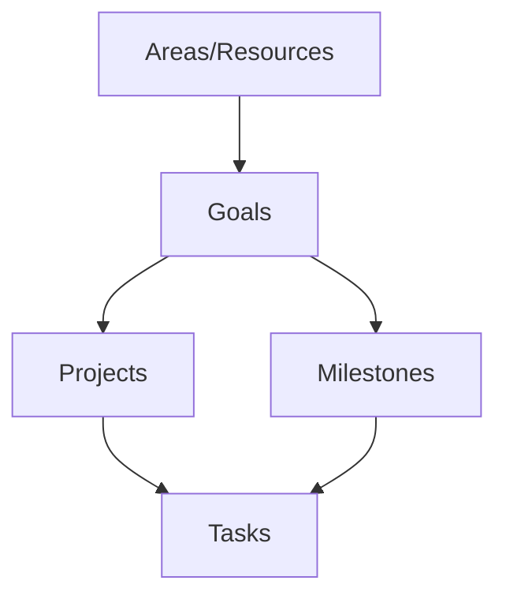

# Ultimate Brain System Analysis

This document provides a deep analysis of the "Ultimate Brain" Notion setup. It is intended to be the single source of truth for understanding the architecture, databases, and relationships within this workspace.

*Generated by Igor, your AI Assistant.*

## 1. System Architecture Diagram

This diagram illustrates the primary relationships between the core databases in the Ultimate Brain system. The hierarchy flows from broad life areas down to individual tasks.

--- 

## 2. Core Databases Schema

This section details the properties of the primary databases in the system.

### 2.1. All Tasks [UB]

-   **ID**: `13f6cd2d-3715-477a-bb89-1a9be066462c`
-   **Description**: This is the "master database" that runs the entire template. All other views contain Linked Database blocks that link back to this master task list.

#### Properties:

| Property Name           | Type               | Description                                                                                                                              |
| ----------------------- | ------------------ | ---------------------------------------------------------------------------------------------------------------------------------------- |
| **Task**                | `title`            | The name of the task. **Primary Key**.                                                                                                   |
| **Project**             | `relation`         | Links the task to the `Projects [UB]` database. This is a critical link for organizing work.                                             |
| **Done**                | `checkbox`         | A simple checkbox to mark a task as complete. Used in many formulas.                                                                   |
| **Due**                 | `date`             | The deadline for the task. Can be a single date or a date range.                                                                         |
| **Priority**            | `status`           | The priority level of the task (🚨HIGH, 🧀 Medium, 🧊 Low).                                                                               |
| **State**               | `formula`          | A visual indicator of the task's status (e.g., 🟢 for due today, 🔴 for overdue).                                                        |
| **Smart List**          | `select`           | A GTD-style property to categorize tasks into `Do Next`, `Delegated`, or `Someday`.                                                      |
| **Parent Task**         | `relation` (to self) | Creates a parent-child relationship between tasks, allowing for sub-tasks.                                                             |
| **Sub-Tasks**           | `relation` (to self) | The other side of the Parent Task relation, showing all sub-tasks.                                                                     |
| **Contexts**            | `multi_select`     | Tags for where the task can be done or the required energy level (e.g., `Home`, `High-Energy`).                                          |
| **Recur Unit**          | `select`           | The unit for recurring tasks (`Day(s)`, `Week(s)`, `Month(s)`, etc.). Part of a complex system.                                           |
| **Recur Interval**      | `number`           | The number associated with the Recur Unit (e.g., every **3** weeks).                                                                     |
| **Next Due**            | `formula`          | **One of the most complex formulas.** Calculates the next due date for recurring tasks based on the interval and the last completion date.  |
| **Assignee**            | `people`           | Who is responsible for the task.                                                                                                         |
| **Created**             | `created_time`     | Automatically records when the task was created.                                                                                         |
| **Edited**              | `last_edited_time` | Automatically records the last time the task was edited.                                                                                 |
| *and many others...*    | ...                | The database contains numerous other formula and rollup properties for sorting, display, and advanced GTD workflows.                     |

### 2.2. Projects [UB]

-   **ID**: `94e3f796-ffc0-469d-9c3d-44271d1f2d2b`
-   **Description**: This database holds all high-level projects. Each project can contain multiple tasks.

#### Properties:

| Property Name     | Type         | Description                                                                                                   |
| ----------------- | ------------ | ------------------------------------------------------------------------------------------------------------- |
| **Name**          | `title`      | The name of the project. **Primary Key**.                                                                     |
| **Tasks**         | `relation`   | Links to the `All Tasks [UB]` database, showing all tasks associated with this project.                         |
| **Status**        | `status`     | The current status of the project (`To Do`, `Doing`, `On Hold`, `Done`).                                        |
| **Progress**      | `formula`    | A formula that calculates the percentage of completed tasks within the project.                               |
| **Area**          | `relation`   | Links the project to a higher-level `Areas/Resources [UB]` database (e.g., "Finance", "Health").                |
| **Goal**          | `relation`   | Links the project to an even higher-level `Goals [UB]` database.                                                |
| **Target Deadline** | `date`       | The overall deadline for the entire project.                                                                  |
| **Archived**      | `checkbox`   | A checkbox to hide the project from active views without deleting it.                                         |

### 2.3. Goals [UB]

-   **ID**: `89608e52-352f-4bf6-b3da-cfd82bd28e3a`
-   **Description**: This is the highest level of the hierarchy, representing major life goals. Each goal can be broken down into projects.

#### Properties:

| Property Name     | Type         | Description                                                                                                   |
| ----------------- | ------------ | ------------------------------------------------------------------------------------------------------------- |
| **Goal**          | `title`      | The name of the goal. **Primary Key**.                                                                        |
| **Projects**      | `relation`   | Links to the `Projects [UB]` database, showing all projects that contribute to this goal.                     |
| **Area**          | `relation`   | Links the goal to a top-level `Areas/Resources [UB]` database.                                                  |
| **Milestones**    | `relation`   | Links to the `Milestones [UB]` database, which can be used to break down large goals.                           |
| **Target Deadline** | `date`       | The target date for achieving the goal.                                                                       |
| **Progress**      | `formula`    | A formula that calculates the percentage of completed milestones or projects related to the goal.               |
| **Archived**      | `checkbox`   | Hides the goal from active views.                                                                             |

### 2.4. Areas/Resources [UB]

-   **ID**: `c0577cc8-6f6d-4786-af17-dc2153e7db52`
-   **Description**: The top-level organizer. Distinguishes between broad 'Areas' of life/work (e.g., Finance, Health) and 'Resources' which can be collections of information. This is the anchor for the entire P.A.R.A. structure.

#### Properties:

| Property Name     | Type         | Description                                                                                                   |
| ----------------- | ------------ | ------------------------------------------------------------------------------------------------------------- |
| **Name**          | `title`      | The name of the Area or Resource. **Primary Key**.                                                            |
| **Type**          | `select`     | A critical property that defines the entry as either an 'Area' or a 'Resource'.                               |
| **Goals**         | `relation`   | Links to the `Goals [UB]` database, showing which goals fall under this area of life.                         |
| **Projects**      | `relation`   | Links to the `Projects [UB]` database, showing all projects associated with this area.                        |
| **Root Area**     | `relation`   | For a 'Resource', this links it to its parent 'Area'.                                                         |
| **Resources**     | `relation`   | The other side of the 'Root Area' relation. For an 'Area', this shows all child 'Resources'.                  |
| **Archived**      | `checkbox`   | A checkbox to hide the area from active views.                                                                |

--- 

## 3. Key Pages & Views

This section analyzes the main pages and dashboards that make up the user-facing part of the system.

### 3.1. The "My Day" Page

-   **Page ID**: `707161eb-b8c2-454f-a7d7-9a8b35f1f2bf`
-   **Purpose**: This page acts as a daily dashboard and the primary workspace for planning and executing the day's tasks. It is designed to provide a focused view that prevents the user from being overwhelmed by the entire task list.
-   **Core Rationale**: Following GTD principles, the "My Day" page is where you decide what to work on *now*. It separates the act of *planning* from the act of *doing*.

#### Structure & Views:

Based on the block structure and the UB template, this page likely contains several key filtered views of the `All Tasks [UB]` database:

-   **Today's Plan**: A primary view showing only tasks that have been manually dragged into the "My Day" view. This is the user's intentional plan for the day.
-   **Due Today**: A filtered view showing all tasks from the master task list where the `Due` date is today. This acts as a reminder of hard deadlines.
-   **Overdue**: A filtered view showing tasks where the `Due` date is in the past and the `Done` checkbox is not checked. This is an urgent "needs attention" list.
-   **Calendar View**: Often includes a linked view of the user's calendar or tasks with specific times assigned, giving a chronological overview of the day.

This page is the heart of the daily workflow and a key area for Igor to interact with, for example, by automatically adding high-priority tasks from email to the "Due Today" view.

### 3.2. The "Quick Capture" Page

-   **Page ID**: `06953fce-53d1-47fb-bcbc-d1ce97c34284`
-   **Purpose**: To serve as a universal, frictionless inbox for all incoming information, tasks, and ideas. This page is optimized for speed, allowing the user to dump thoughts quickly without needing to categorize or process them immediately.
-   **Core Rationale**: This is the "Capture" step in GTD. The goal is to get things out of your head and into a trusted system instantly. Processing and organization happen later, in a separate step, which prevents the friction of premature organization from hindering capture.

#### Structure & Views:

The "Quick Capture" page typically contains very simple, unfiltered views of the core databases, designed for creating new entries:

-   **Task Inbox**: A view of the `All Tasks [UB]` database filtered to show only items where no `Status`, `Project`, or `Due Date` has been assigned. This is the default entry point for new tasks.
-   **Notes Inbox**: A similar view of a `Notes` database, for capturing thoughts, meeting notes, or web clippings that are not yet actionable tasks.
-   **New Entry Buttons**: Often includes template buttons to quickly create a new task or note with a single click.

This page is a prime target for Igor. An AI-powered action like `igor capture "Remember to buy milk"` would programmatically add a new item directly to the Task Inbox on this page, perfectly mimicking the intended human workflow.

### 3.3. The "Process" Page

-   **Page ID**: `9164aa0b-5525-49cd-bea5-ad6147466f44`
-   **Purpose**: This page is dedicated to the "Process/Clarify" step of the GTD methodology. After capturing tasks and ideas in the "Quick Capture" inbox, this is where the user goes to make decisions about each item.
-   **Core Rationale**: The goal is to empty the inbox by handling each item one by one. For each item, the user decides: Is it actionable? If so, what is the next action? Does it belong to a project? Can it be done in under 2 minutes? Should it be delegated or deferred?

#### Structure & Views:

This page will almost certainly contain a view of the `All Tasks [UB]` database with a very specific filter:

-   **Inbox View**: A filtered view showing only tasks that are in the "Inbox" state (i.e., they have not yet been assigned a project, due date, or `Do Next` status). This is the working area for processing.
-   **Supporting Views**: It might also include small, linked views of the `Projects [UB]` and `Areas/Resources [UB]` databases to make it easy to drag-and-drop or relate tasks to their respective contexts during processing.

Igor can play a significant role here. In the future, the `analyze` command could be triggered on an inbox item, and its suggestions for project, labels, and next actions would directly assist the user in this processing phase.

### 3.4. The "Plan" Page

-   **Page ID**: `80689f02-37f2-4810-b092-09613462df38`
-   **Purpose**: To provide a mid-to-high level overview for weekly, monthly, and quarterly planning. This page moves beyond daily execution and helps the user align their upcoming work with their larger projects and goals.
-   **Core Rationale**: This is the "Reflect" step in GTD, adapted for forward-looking planning. It's where the user performs their weekly review, assesses progress on projects, and plans the upcoming week or month to ensure they are on track to meet their goals.

#### Structure & Views:

This page likely contains calendar and timeline views of the core databases:

-   **Weekly Calendar**: A view of the `All Tasks [UB]` database formatted as a calendar, showing all tasks with a due date in the current week.
-   **Project Timeline**: A timeline or Gantt chart view of the `Projects [UB]` database, showing the planned start and end dates for various projects.
-   **Quarterly Goals**: A filtered view of the `Goals [UB]` database, showing only the goals relevant to the current quarter.

Igor could assist here by generating a "Weekly Briefing" that summarizes completed tasks from the past week and highlights overdue tasks and upcoming project deadlines.

### 3.5. The "Task Manager" Page

-   **Page ID**: `8cd0b80d-18de-4421-9dcf-fe5372c2d95e`
-   **Purpose**: To provide a comprehensive, multi-faceted view of all tasks in the system. This is the "command center" for tasks, offering more powerful and varied perspectives than the focused daily or weekly planning pages.
-   **Core Rationale**: While other pages are for planning and execution, the Task Manager is for organization and review. It allows the user to see their entire task landscape, slice it by project or context, and ensure nothing falls through the cracks.

#### Structure & Views:

This page is likely a collection of many different filtered views of the `All Tasks [UB]` database, probably organized in toggles or tabs:

-   **View by Project**: A list of tasks grouped by the project they belong to.
-   **View by Context**: Tasks grouped by contexts like `@Home`, `@Work`, `@Computer`, allowing the user to see what they can do based on their current situation.
-   **Delegated Tasks**: A list of tasks assigned to other people, filtered by the `Assignee` property.
-   **Someday/Maybe**: A view of tasks that have been intentionally deferred to the future, filtered by the `Smart List` property being set to "Someday".
-   **Full Calendar/Timeline**: A comprehensive calendar or timeline showing all tasks with due dates, not just those for the current week.

### 3.6. The "Notes" Page

-   **Page ID**: `ae61945b-007b-4670-9e9d-4fe657337d93`
-   **Purpose**: To act as the central hub for the knowledge base, or the "second brain" aspect of the system. This is where non-actionable information, thoughts, meeting notes, and research are stored and organized.
-   **Core Rationale**: This page separates the storage of reference material from the management of tasks. It allows for a clean and organized system where tasks live in one place, and the knowledge needed to complete them lives in another, linked, place.

#### Structure & Views:

This page likely contains powerful views of a dedicated `Notes` database, allowing the user to find information easily:

-   **Note Inbox**: A view for newly captured notes that have not yet been processed or tagged.
-   **View by Area/Resource**: Notes grouped by the `Area` or `Resource` they relate to, creating a browsable knowledge library.
-   **Review Queue**: May contain a view of notes that have been marked for later review, using a spaced repetition or similar methodology.
-   **Meeting Notes**: A filtered view showing only notes that are tagged as "Meeting Note".

Igor can interact with this page by creating new notes from external sources (e.g., `igor save-article <URL>`) or by searching this knowledge base to provide context for a task or a new email.

### 3.7. The "Projects" Page

-   **Page ID**: `d689b895-2078-4e9d-a9d6-5daa595dfd9f`
-   **Purpose**: To provide a high-level overview of all active and planned projects. This is the main dashboard for project management.
-   **Core Rationale**: This page allows for strategic review of all ongoing efforts. Unlike the `Task Manager` which is tactical, the `Projects` page is for strategic oversight, helping to manage workload, and see how different projects are progressing in relation to each other.

#### Structure & Views:

This page contains multiple advanced views of the `Projects [UB]` database:

-   **Active Projects Gallery**: A gallery or board view showing all projects where the `Status` is 'Doing' or 'Ongoing'. This provides an at-a-glance view of current commitments.
-   **Timeline View**: A Gantt chart showing all projects with a `Target Deadline`, allowing for long-term planning and dependency management.
-   **View by Area**: Projects grouped by the `Area` they belong to, helping to visualize the workload in different parts of life or business.
-   **Backlog/To Do**: A simple list of projects where the `Status` is 'To Do', representing the queue of upcoming work.

Igor can use this page to provide a "Weekly Project Briefing," summarizing the progress percentage change for each active project.

### 3.8. The "Areas" Page

-   **Page ID**: `14da05ac-0108-4264-99f8-2fdafe923bda`
-   **Purpose**: To provide a master view of all the high-level domains of the user's life and work. This page represents the "A" in P.A.R.A. (Projects, Areas, Resources, Archives).
-   **Core Rationale**: This dashboard allows the user to review all their main responsibilities and areas of interest at a glance. It ensures that projects and goals are properly aligned with the broader domains of life they are meant to support.

#### Structure & Views:

This page contains filtered views of the `Areas/Resources [UB]` database:

-   **Active Areas**: A gallery or list view showing all entries where the `Type` property is set to 'Area' and the `Archived` checkbox is unchecked.
-   **Resources by Area**: It likely contains views that group `Resource`-type entries under their respective parent `Area`, creating an organized library of reference material for each domain of life.

Igor can use the information from this page to understand the user's core responsibilities. For example, when analyzing an email, if the content matches keywords related to an 'Area' (e.g., "Finance"), it can suggest linking the email or a resulting task to that specific Area.

### 3.9. The "Resources" Page

-   **Page ID**: `3b96cd17-27d2-4bb4-8003-e19cbf978aa0`
-   **Purpose**: To provide a master view of all reference material and topics of interest that support the user's Areas. This page represents the "R" in P.A.R.A.
-   **Core Rationale**: While an 'Area' is a domain of responsibility with a standard to be maintained (e.g., "Finances"), a 'Resource' is a topic of ongoing interest (e.g., "AI Research", "Guitar Chords", "Stoic Philosophy"). This page allows the user to browse their library of knowledge.

#### Structure & Views:

This page contains filtered views of the `Areas/Resources [UB]` database:

-   **Active Resources**: A gallery or list view showing all entries where the `Type` property is set to 'Resource' and the `Archived` checkbox is unchecked.
-   **Recent Notes by Resource**: The page might also include views of the `Notes` database, showing the most recent notes grouped by the Resource they are tagged with.

This distinction is important for Igor. When analyzing information, Igor can learn to differentiate between suggesting an action that falls under an "Area" of responsibility versus saving information as reference material under a "Resource" topic.

### 3.10. The "Goals" Page

-   **Page ID**: `b24ec327-c60d-45a5-97b4-2c282f333cc7`
-   **Purpose**: To track progress on high-level, long-term goals. This is the "why" behind the projects and tasks.
-   **Core Rationale**: This page provides a motivational overview and ensures that the daily and weekly work is contributing to a larger, meaningful objective. It's the highest point in the P.A.R.A. hierarchy.

#### Structure & Views:

This page contains views of the `Goals [UB]` database, likely designed for inspiration and review:

-   **Active Goals**: A gallery or list view showing all goals that are not archived.
-   **Progress View**: A view that prominently features the `Progress` formula property for each goal, showing a visual progress bar of how close each goal is to completion.
-   **Goals by Area**: Goals grouped by the `Area` they belong to, showing, for example, all "Finance" goals together.

This page is a critical source of context for Igor's AI. By understanding the user's core goals, Igor can make much more intelligent suggestions about how to prioritize tasks, which projects to focus on, and how new information relates to the user's ultimate ambitions.

### 3.11. The "Archive" Page

-   **Page ID**: `c96380b0-9ce2-45b7-ba0b-4eab2a83d4f4`
-   **Purpose**: To act as a repository for all items (Tasks, Projects, Goals, Notes, etc.) that are no longer active but should not be permanently deleted.
-   **Core Rationale**: A key principle of a productive system is keeping the active workspace clean and relevant. The Archive allows the user to remove completed or obsolete items from view, reducing clutter and mental overhead, while still preserving them for future reference if needed.

#### Structure & Views:

The Archive page contains views of all major databases, but with one critical filter applied:

-   **Archived Items**: Each view (for Tasks, Projects, Goals, etc.) is filtered to show only items where the `Archived` property checkbox is checked `true`.
-   **No Other Filters**: Typically, these views are simple lists, not grouped or sorted in any complex way, as the main goal is just storage.

The `Archived` checkbox is the universal mechanism across the entire Ultimate Brain system for moving an item to this page. Igor can leverage this by suggesting an item be archived, or by programmatically checking the box on a user's command.

--- 